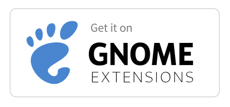
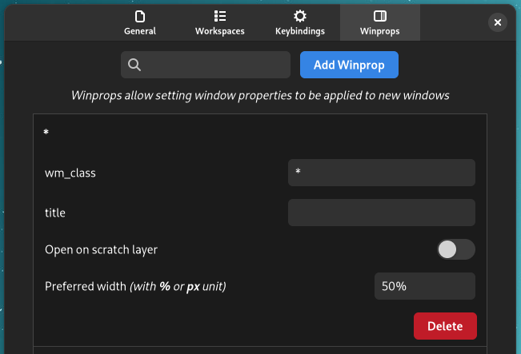
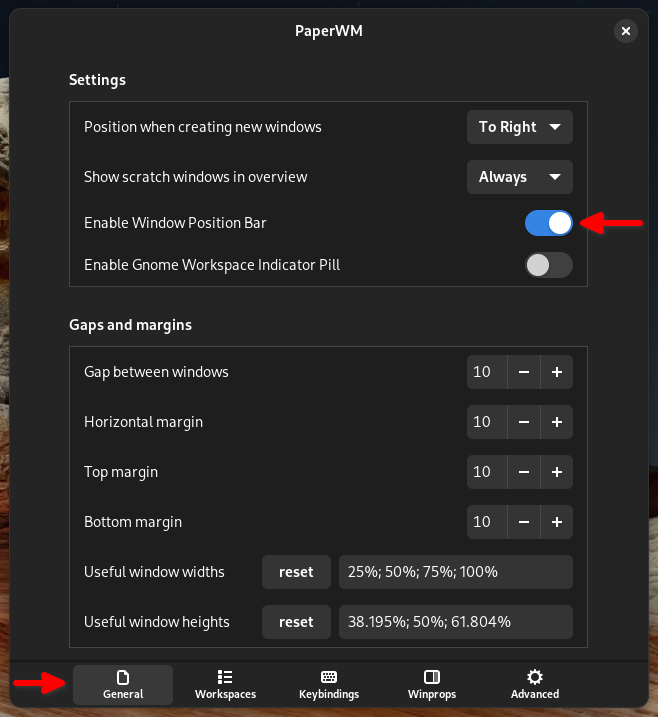
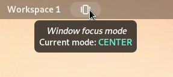
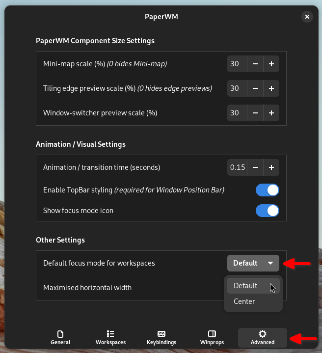
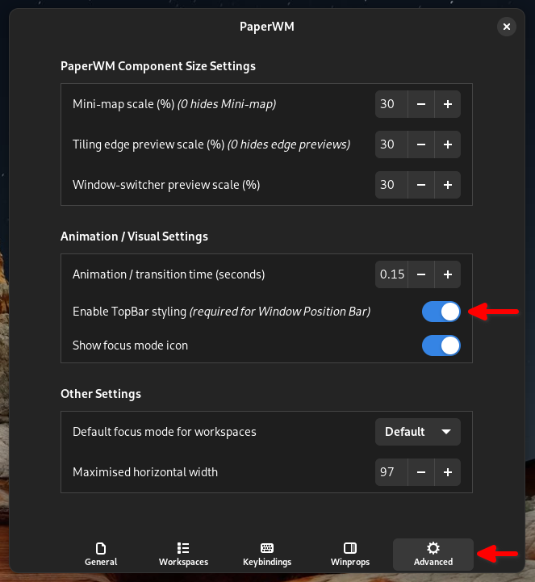

# PaperWM #

[](https://github.com/paperwm/PaperWM/discussions)

PaperWM is a [Gnome Shell](https://wiki.gnome.org/Projects/GnomeShell) extension which provides scrollable tiling of windows and per monitor workspaces. It's inspired by paper notebooks and tiling window managers.

Can be installed on Gnome Shells from 3.28 to 45 on X11 and wayland.

_While PaperWM can be installed on a wide range of Gnome versions, new features aren't generally backported to previous versions.  Fixes may be backported on request (please submit a [new issue](https://github.com/paperwm/PaperWM/issues/new/choose) if you've identified a recent fix that should be backported and you can help with testing)._

While technically an [extension](https://wiki.gnome.org/Projects/GnomeShell/Extensions) it's to a large extent built on top of the Gnome desktop rather than merely extending it.

Have questions or comments?  Please ask on our [Github Discussions](https://github.com/paperwm/PaperWM/discussions) board.

## Installation

### Install via [extensions.gnome.org](https://extensions.gnome.org/extension/6099/paperwm/)

[](https://extensions.gnome.org/extension/6099/paperwm/)

### Install via Source

Clone the repo and check out the branch supporting the Gnome Shell version you're running.

- 45-46 (currently developed/supported): https://github.com/paperwm/PaperWM/tree/release
- 42-44: https://github.com/paperwm/PaperWM/tree/gnome-44
- 40-41: https://github.com/paperwm/PaperWM/tree/gnome-40
- 3.28-3.38: https://github.com/paperwm/PaperWM/tree/gnome-3.38


Then run the [`install.sh`](https://github.com/paperwm/PaperWM/blob/release/install.sh) script
from the repository. The installer will create a link to the repo in
`~/.local/share/gnome-shell/extensions`. It will then ask if you want to enable PaperWM.
```bash
./install.sh # install, load and enable paperwm
```
> #### ➡️ You will need to restart Gnome shell after installing PaperWM, e.g. logout then login, or restart in place with an `alt-F2` and entering `r` (X11 only).
>
> After logging back in, you will can then enable PaperWM via the `Extensions` application, or by running the following command from the command-line:
>
> ```bash
> /usr/bin/gnome-extensions enable paperwm@paperwm.github.com
> ```

> if you have run into issues, delete any older `paperwm@...` symlinks from `~/.local/share/gnome-shell/extensions` and re-run the `install.sh` script.

### Uninstall PaperWM
To uninstall simply run `./uninstall.sh`.

Running the extension will automatically install a user config file as described in [User configuration & development](#user-configuration--development).

## Contributing
Users are enouraged to submit [issues](https://github.com/paperwm/PaperWM/issues/new/choose) and [Pull Requests](https://github.com/paperwm/PaperWM/pulls)!

> #### ➡️ Please ensure pull requests are based off, and submitted to, [develop](https://github.com/paperwm/PaperWM/tree/develop) branch.
> 
> Pull requests submitted to the `release` branch will not be accepted (but don't worry, if you accidentally submit a PR to the `release` branch we won't be mad, and will just ask you to change it).

## Usage ##

Most functionality is available using a mouse, eg. activating a window at the edge of the monitor by clicking on it. In wayland its possible to navigate with 3-finger swipes on the trackpad. But the primary focus is making an environment which works well with a keyboard.

Most keybindings start with the <kbd>Super</kbd> modifier (by default), which is usually the Windows key, or on mac keyboards it's the Command key. It's possible to modify the keyboard layout so that <kbd>Super</kbd> is switched with <kbd>Alt</kbd> making all the keybindings easier to reach. This can be done through Gnome Tweaks under `Keybard & Mouse` ⟶ `Additional Layout Options` ⟶ `Alt/Win key behavior` ⟶ `Left Alt is swapped with Left Win`.

Most keybindings will grab the keyboard while <kbd>Super</kbd> is held down, only switching focus when <kbd>Super</kbd> is released. <kbd>Escape</kbd> will abort the navigation taking you back to the previously active window.

Adding <kbd>Ctrl</kbd> to a keybinding will take the current window with you when navigating.

Window management and navigation is based around the three following concepts.

### Scrollable window tiling ###


New windows are automatically tiled to the right of the active window, taking up as much height as possible. <kbd>Super</kbd><kbd>Return</kbd> will open a new window of the same type as the active window.

Activating a window will ensure it's fully visible, scrolling the tiling if necessary. Pressing <kbd>Super</kbd><kbd>.</kbd> activates the window to the right. <kbd>Super</kbd><kbd>,</kbd> activates the window to the left. On a US keyboard these keys are intuitively marked by <kbd><</kbd> and <kbd>></kbd>, they are also ordered the same way on almost all keyboard layouts. Navigating around windows brings up the minimap as can be seen in the above screenshot. The minimap will stay visible as long as <kbd>Super</kbd> is continually being pressed.

Pressing <kbd>Super</kbd><kbd>I</kbd> will move the window to the right below the active window, tiling them vertically in a column. <kbd>Super</kbd><kbd>O</kbd> will do the opposite, pushing the bottom window out of the current column.

Swiping the trackpad horizontally with three fingers (only available in Wayland) or swiping the panel horizontally on a touch screen will scroll the tiling.

<kbd>Alt</kbd><kbd>Tab</kbd> is of course also available.

PaperWM doesn't handle attached modal dialogs very well, so it's best to turn it off in Gnome Tweaks (under Windows).

| Keybindings                                                                                       |                                                             |
| ------                                                                                            | -------                                                     |
| <kbd>Super</kbd><kbd>,</kbd> or <kbd>Super</kbd><kbd>.</kbd>                                      | Activate the next or previous window                        |
| <kbd>Super</kbd><kbd>Left</kbd> or <kbd>Super</kbd><kbd>Right</kbd>                               | Activate the window to the left or right                    |
| <kbd>Super</kbd><kbd>Up</kbd> or <kbd>Super</kbd><kbd>Down</kbd>                                  | Activate the window above or below                          |
| <kbd>Super</kbd><kbd>Home</kbd> or <kbd>Super</kbd><kbd>End</kbd>                                 | Activate the first or last window                           |
| <kbd>Super</kbd><kbd>Ctrl</kbd><kbd>,</kbd> or <kbd>Super</kbd><kbd>Ctrl</kbd><kbd>.</kbd>        | Move the current window to the left or right                |
| <kbd>Super</kbd><kbd>Ctrl</kbd><kbd>Left</kbd> or <kbd>Super</kbd><kbd>Ctrl</kbd><kbd>Right</kbd> | Move the current window to the left or right                |
| <kbd>Super</kbd><kbd>Ctrl</kbd><kbd>Up</kbd> or <kbd>Super</kbd><kbd>Ctrl</kbd><kbd>Down</kbd>    | Move the current window up or down                          |
| <kbd>Super</kbd><kbd>t</kbd>                                                                      | Take the window, placing it when finished navigating        |
| <kbd>Super</kbd><kbd>Tab</kbd> or <kbd>Alt</kbd><kbd>Tab</kbd>                                    | Cycle through the most recently used windows                |
| <kbd>Super</kbd><kbd>Shift</kbd><kbd>Tab</kbd> or <kbd>Alt</kbd><kbd>Shift</kbd><kbd>Tab</kbd>    | Cycle backwards through the most recently used windows      |
| <kbd>Super</kbd><kbd>C</kbd>                                                                      | Center the active window horizontally                       |
| <kbd>Super</kbd><kbd>R</kbd>                                                                      | Resize the window (cycles through useful widths)            |
| <kbd>Super</kbd><kbd>Alt</kbd><kbd>R</kbd>                                                        | Resize the window (cycles backwards through useful widths)  |
| <kbd>Super</kbd><kbd>Shift</kbd><kbd>R</kbd>                                                      | Resize the window (cycles through useful heights)           |
| <kbd>Super</kbd><kbd>Shift</kbd><kbd>Alt</kbd><kbd>R</kbd>                                        | Resize the window (cycles backwards through useful heights) |
| <kbd>Super</kbd><kbd>F</kbd>                                                                      | Maximize the width of a window                              |
| <kbd>Super</kbd><kbd>Shift</kbd><kbd>F</kbd>                                                      | Toggle fullscreen                                           |
| <kbd>Super</kbd><kbd>Return</kbd> or <kbd>Super</kbd><kbd>N</kbd>                                 | Create a new window from the active application             |
| <kbd>Super</kbd><kbd>Backspace</kbd>                                                              | Close the active window                                     |
| <kbd>Super</kbd><kbd>I</kbd>                                                                      | Absorb the window to the right into the active column       |
| <kbd>Super</kbd><kbd>O</kbd>                                                                      | Expel the bottom window out to the right                    |


### The workspace stack & monitors ###

Pressing <kbd>Super</kbd><kbd>Above_Tab</kbd> will slide the active workspace down revealing the stack as shown in the above screenshot. You can then flip through the most recently used workspaces with repeated <kbd>Above_Tab</kbd> presses while holding <kbd>Super</kbd> down. <kbd>Above_Tab</kbd> is the key above <kbd>Tab</kbd> (<kbd>\`</kbd> in a US qwerty layout). Like alt-tab <kbd>Shift</kbd> is added to move in reverse order:


Pressing <kbd>Super</kbd><kbd>Page_Down</kbd> and <kbd>Super</kbd><kbd>Page_Up</kbd> will slide between workspaces sequentially:


By default <kbd>Super</kbd><kbd>Page_Down</kbd> and <kbd>Super</kbd><kbd>Page_Down</kbd> are bound to the keybindings "Switch to workspace below/above (**ws from current monitor**)". That means using the keybindings you can select all workspaces that were previously shown on the current monitor and all empty once.

Alternatively you can change these keybindings to "Switch to workspace below/above (**ws from all monitors**)" in the settings. That way you can switch to **all** workspaces (that are not currently shown on another monitor). Depending on your workflow this might feel more natural.

The workspace name is shown in the top left corner replacing the `Activities` button adding a few enhancements. Scrolling on the name will let you browse the workspace stack just like <kbd>Super</kbd><kbd>Above_Tab</kbd>. Left clicking on the name opens Gnome overview, while right clicking the name lets you access and change the workspace name.

> If you prefer to use another workspace indicator (or prefer none at all), you can hide this workspace name element from Gnome topbar by executing the following command from a terminal:
>
> ```
> dconf write /org/gnome/shell/extensions/paperwm/show-workspace-indicator false
> ```

Swiping down on the trackpad vertically with three fingers will initiate the workspace stack, and then allow you navigate the workspace stack with 3-finger vertical swipes (only available in Wayland).  See the [Touchpad Gestures](#touchpad-gestures) section for more information on gesture support in PaperWM.

There's a single scrollable tiling per workspace. Adding another monitor simply makes it possible to have another workspace visible. The workspace stack is shared among all the monitors, windows being resized vertically as necessary when workspace is displayed on another monitor.

PaperWM currently works best using the workspaces span monitors preference, this can be turned on with Gnome Tweaks under Workspaces. If you want to use workspaces only on primary you need to place the secondary monitor either below or above the primary (with the best result having it below).

| Workspace Keybindings                                                  |                                                                                   |
| ------                                                                 | -------                                                                           |
| <kbd>Super</kbd><kbd>Above_Tab</kbd>                                   | Cycle through the most recently used workspaces                                   |
| <kbd>Super</kbd><kbd>Shift</kbd><kbd>Above_Tab</kbd>                   | Cycle backwards through the most recently used workspaces                         |
| <kbd>Super</kbd><kbd>Ctrl</kbd><kbd>Above_Tab</kbd>                    | Cycle through the most recently used, taking the active window with you           |
| <kbd>Super</kbd><kbd>Ctrl</kbd><kbd>Shift</kbd><kbd>Above_Tab</kbd>    | Cycle backwards through the most recently used, taking the active window with you |
| <kbd>Super</kbd><kbd>Page_Down</kbd>/<kbd>Page_Up</kbd>                | Cycle sequentially through workspaces (from current monitor only)                 |
| *no default keybinding*                                                | Cycle sequentially through workspaces (from all monitors)                         |
| <kbd>Super</kbd><kbd>Ctrl</kbd><kbd>Page_Down</kbd>/<kbd>Page_Up</kbd> | Cycle sequentially through workspaces, taking the active window with you          |


| Monitor Keybindings                                                 |                                            |
| ------                                                              | -------                                    |
| <kbd>Super</kbd><kbd>Shift</kbd><kbd>Arrow_key</kbd>                | Select neighbouring monitor                |
| <kbd>Super</kbd><kbd>Shift</kbd><kbd>Ctrl</kbd><kbd>Arrow_key</kbd> | Move active window to neighbouring monitor |

### Scratch layer ###


The scratch layer is an escape hatch to a familiar floating layout. This layer is intended to store windows that are globally useful like chat applications and in general serve as the kitchen sink.
When the scratch layer is active it will float above the tiled windows, when hidden the windows will be minimized.

Pressing <kbd>Super</kbd><kbd>Escape</kbd> toggles between showing and hiding the windows in the scratch layer.
Activating windows in the scratch layer is done using <kbd>Super</kbd><kbd>Tab</kbd>, the floating windows having priority in the list while active.
When the tiling is active <kbd>Super</kbd><kbd>Shift</kbd><kbd>Tab</kbd> selects the most recently used scratch window.

<kbd>Super</kbd><kbd>Ctrl</kbd><kbd>Escape</kbd> will move a tiled window into the scratch layer or alternatively tile an already floating window. This functionality can also be accessed through the window context menu (<kbd>Alt</kbd><kbd>Space</kbd>).

| Keybindings                                       |                                                                  |
| ------                                            | -------                                                          |
| <kbd>Super</kbd><kbd>Escape</kbd>                 | Toggle between showing and hiding the most recent scratch window |
| <kbd>Super</kbd><kbd>Shift</kbd><kbd>Escape</kbd> | Toggle between showing and hiding the scratch windows            |
| <kbd>Super</kbd><kbd>Ctrl</kbd><kbd>Escape</kbd>  | Toggle between floating and tiling the current window            |
| <kbd>Super</kbd><kbd>Tab</kbd>                    | Cycle through the most recently used scratch windows             |
| <kbd>Super</kbd><kbd>H</kbd>                      | Minimize the current window                                      |

## User configuration & development ##

> ### ⚠️ Gnome 45 removed the ability to add external module files to the search path of extensions.  Hence, modifications to PaperWM via `user.js` is [not currently available in Gnome 45](https://github.com/paperwm/PaperWM/issues/576#issuecomment-1721315729).
>
> `user.js` functionality is still available in PaperWM for previous Gnome shell versions.

A default user configuration, `user.js`, is created in `~/.config/paperwm/` with three functions `init`, `enable` and `disable`. `init` will run only once on startup, `enable` and `disable` will be run whenever extensions are being told to disable and enable themselves.

You can also supply a custom `user.css` in `~/.config/paperwm/`. This user stylesheet can override the default styles of paperwm (e.g. from `~/.local/share/gnome-shell/extensions/paperwm@paperwm-redux.github.com/user.css` or `/usr/share/gnome-shell/extensions/paperwm@paperwm-redux.github.com/user.css`), gnome or even other extensions. The same rules as for CSS in the browser apply (i.e. CSS rules are additive). 

You can reload the `user.css` by disabling (turning off) PaperWM and then re-enabling PaperWM (turning on), e.g via `Extensions` app, or by running `Main.loadTheme()` in looking glass (i.e. <kbd>Alt</kbd><kbd>F2</kbd> `lg` <kbd>Return</kbd>). Note that the latter approach will reload all other .css files (e.g. from other extensions) and `user.css` needs to already be loaded for this to work. So after initially creating the file you'll need to disable then enable PaperWM (or restart Gnome).

We also made an emacs package, [gnome-shell-mode](https://github.com/paperwm/gnome-shell-mode), to make hacking on the config and writing extensions a more pleasant experience. To support this out of the box we also install a `metadata.json` so gnome-shell-mode will pick up the correct file context, giving you completion and interactive evaluation ala. looking glass straight in emacs.

Pressing <kbd>Super</kbd><kbd>Insert</kbd> will assign the active window to a global variable `metaWindow`, its [window actor](https://developer.gnome.org/meta/stable/MetaWindowActor.html) to `actor`, its [workspace](https://developer.gnome.org/meta/stable/MetaWorkspace.html) to `workspace` and its PaperWM style workspace to `space`. This makes it easy to inspect state and test things out.

### Using PaperWM extension settings (UI) to modify settings
PaperWM provides an extension settings UI to modify many of PaperWM's more prevalent settings.  This is available in the `gnome-extensions` application.

_Note: not all PaperWM user-configurable settings are available in the settings UI._

### Using dconf-editor to modify settings
You can use `dconf-editor` to view and modify all PaperWM user settings.  You can view all settings by executing the following command from a terminal:

```shell
GSETTINGS_SCHEMA_DIR=$HOME/.local/share/gnome-shell/extensions/paperwm@paperwm.github.com/schemas dconf-editor /org/gnome/shell/extensions/paperwm/
```

### PaperWM user-configurable settings _not_ available in settings UI

Below is a list of user-configurable settings that are not exposed in the PaperWM settings UI.  These can be modified via [`dconf-editor`](#using-dconf-editor-to-modify-settings).

_Note: experimental, incomplete or deprecated settings may not be listed below._

<details><summary> <h4>Click to expand and see user-configurable properties</h3> </summary>

Setting | Description | Input Type | Default value
--------|-------------|------------|--------------
<code>default&#8209;background</code>| Sets the (default) background used for PaperWM workspaces.  If set will use this background instead of colors defined in `workspace-colors`. | _absolute path_ | _empty_

_Note: you can override this for individual workspaces in the settings UI._

__Example:__
```
dconf write /org/gnome/shell/extensions/paperwm/default-background '"/home/user/Wallpaper/mars-sunset-2k.jpg"'
```

Setting | Description | Input Type | Default value
--------|-------------|------------|--------------
<code>workspace&#8209;colors</code>  | Sets the workspace background color palette. | _String array of colors_ | `['#314E6C', '#565248', '#445632', '#663822', '#494066',   '#826647', '#4B6983', '#807D74', '#5D7555', '#884631', '#625B81', '#B39169', '#7590AE', '#BAB5AB', '#83A67F', '#C1665A', '#887FA3', '#E0C39E']`

</details>

### Setting window specific properties

It's possible to set window properties using simple rules that will be applied when placing new windows. Properties can applied to windows identified by their `wm_class` or `title`.  The following properties are currently supported:

Property              | Input type                          | Input example | Description
----------------------|-------------------------------------|------------------|------------------
`scratch_layer`       | Boolean                             | `true`, `false`  | if `true` window will be placed on the scratch layer.
`preferredWidth`      | String value with `%` or `px` unit         | `"50%"`, `"450px"`    | resizes the window width to the preferred width when it's created. </br>_Note<sup>1</sup>: property not applicable to windows on scratch layer._

Window properties can be added using the `Winprops` tab of the PaperWM extension settings:

https://user-images.githubusercontent.com/30424662/211422647-79e64d56-5dbb-4054-b9a6-32bf3194b636.mp4

The `wm_class` or `title` of a window can be found by using looking glass: <kbd>Alt</kbd><kbd>F2</kbd> `lg` <kbd>Return</kbd> Go to the "Windows" section at the top right and find the window. X11 users can also use the `xprop` command line tool (`title` is referred as `WM_NAME` in `xprop`). The match of `wm_class` and `title` are with an OR condition; and in addition to a plain string matching, a constructed [`RegExp()`](https://developer.mozilla.org/en-US/docs/Web/JavaScript/Reference/Global_Objects/RegExp/RegExp) can be used to utilise regex matching.  For example, e.g. `/.*terminal.*/i` would match on any value that contains the word "terminal" (case-insensitive).

### Setting a default window property rule

You can use the functionality defined in the [setting window specific properities](#setting-window-specific-properties) section to define a `default` window property rule that will be applied to all windows NOT matched by a more specific window property rule.

You do this by using the special "match all" operator `*` as an input for `wm_class` or `title`.  The below image shows setting a default `Preferred width` value of `50%`.



This special operator is at a lower precedence, so more specific properties that match a window will always take precedence and be applied.

### New Window Handlers

> #### ⚠️ Gnome 45 removed the ability to add external module files to the search path of extensions.  Hence, the below `user.js` functionality is not currently available in Gnome 45.

If opening a new application window with <kbd>Super</kbd><kbd>Return</kbd> isn't doing exactly what you want, you can create custom functions to suit your needs. For example, you might want new emacs windows to open the current buffer by default, or have new terminals inherit the current directory.  To implement this, you can modify `user.js` as below (see [User configuration & development](#user-configuration--development) section):

```javascript
// -*- mode: gnome-shell -*-
const Extension = imports.misc.extensionUtils.getCurrentExtension();
const App = Extension.imports.app;

function enable() {
    App.customHandlers['emacs.desktop'] =
        () => imports.misc.util.spawn(['emacsclient', '--eval', '(make-frame)']);
    App.customHandlers['org.gnome.Terminal.desktop'] =
        (metaWindow, app) => app.action_group.activate_action(
          "win.new-terminal",
          new imports.gi.GLib.Variant("(ss)", ["window", "current"]));
}
```

The app id of a window can be looked up like this:

```javascript
let Shell = imports.gi.Shell;
let Tracker = Shell.WindowTracker.get_default();
let app = Tracker.get_window_app(metaWindow);
app.get_id();
```

Available application actions can be listed like this:
```javascript
app.action_group.list_actions();
```

### Keybindings

Due to limitations in the mutter keybinding API we need to steal some built in Gnome Shell actions by default. Eg. the builtin action `switch-group` with the default <kbd>Super</kbd><kbd>Above_Tab</kbd> keybinding is overridden to cycle through recently used workspaces. If an overridden action has several keybindings they will unfortunately all activate the override, so for instance because <kbd>Alt</kbd><kbd>Above_Tab</kbd> is also bound to `switch-group` it will be overridden by default. If you want to avoid this, eg. you want <kbd>Alt</kbd><kbd>Tab</kbd> and <kbd>Alt</kbd><kbd>Above_Tab</kbd> to use the builtin behavior simply remove the conflicts (ie. <kbd>Super</kbd><kbd>Tab</kbd> and <kbd>Super</kbd><kbd>Above_Tab</kbd> and their <kbd>Shift</kbd> variants) from `/org/gnome/desktop/wm/keybindings/switch-group` (no restarts required).

#### User defined keybindings

> #### ⚠️ Gnome 45 removed the ability to add external module files to the search path of extensions.  Hence, the below `user.js` and `examples/keybindings.js` functionality is not currently available in Gnome 45.

`Extension.imports.keybindings.bindkey(keystr, name, handler, options)`

Option              | Values              | Meaning
--------------------|---------------------|------------------------------------
`activeInNavigator` | `true`, **`false`** | The keybinding is active when the minimap/navigator is open
`opensMinimap`    | `true`, **`false`** | The minimap will open when the keybinding is invoked

```javascript
let Keybindings = Extension.imports.keybindings;
Keybindings.bindkey("<Super>j", "my-favorite-width",
                    (metaWindow) => {
                        let f = metaWindow.get_frame_rect();
                        metaWindow.move_resize_frame(true, f.x, f.y, 500, f.h);
                    },
                    { activeInNavigator: true });
```

See `examples/keybindings.js` for more examples.

### Touchpad Gestures  ###

PaperWM implements the following touchpad gestures by default:

Gesture                       | Action              
------------------------------|------------------------------------------------------
three-finger swipe up         | Gnome Overview #setting-window-specific-properties
three-finger swipe down       | PaperWM workspace stack view (see [here](#the-workspace-stack--monitors))
three-finger swipe left/right | Moves tiling viewport (windows) left / right

PaperWM touchpad gesture behaviour can be modified via the `General` tab in PaperWM settings:


## Window Position Bar (colored bar segment in Top Bar) ##

[#476](https://github.com/paperwm/PaperWM/pull/476) added a coloured window position bar to the Gnome Top Bar.  This allows users to visually identify the current selected window position of the scrollable viewport in the current workspace.  This is demonstrated in the following video:

https://user-images.githubusercontent.com/30424662/221416159-464d7512-5174-451b-9035-0ee84f9eb4ec.mp4

The window position bar can be _disabled_ from `PaperWM extension settings`:



You can style both the coloured position bar and the dimmed "position bar backdrop" by overriding the `paperwm-window-position-bar` and `paperwm-window-position-bar-backdrop` CSS classes respectively (see `user.css` in [User configuration & development](#user-configuration--development) section for more information). The `paperwm-window-position-bar` will also inherit the selection color (same as window borders) from `tile-preview`.

_Note: PaperWM overrides the default Gnome Top Bar style to be completely transparent so that the dimmed `window-position-bar-backdrop` and `window-position-bar` elements are visible._

## Window Focus Mode ##

[#482](https://github.com/paperwm/PaperWM/pull/482) added the concept of `window focus modes` to PaperWM.  A `focus mode` controls how windows are "focused".  For example, the `CENTER` focus mode causes all windows to be centered horizontally on selection, whereas the `DEFAULT` focus mode is the traditional PaperWM behaviour.

Focus modes can be toggled by user-settable keybinding (default is `Super`+`Shift`+`c`), or by clicking the new focus-mode button in the topbar:



### Setting the default focus mode

The default focus mode is the standard PaperWM focus mode (i.e. not centered).  This can be changed according to preference by changing the `Default focus mode` setting PaperWM settings.  



_Note: changing this setting during a PaperWM session will set all spaces to the new default focus mode._

### Hiding the focus mode icon

Users may also prefer to hide the focus mode icon.  You can do so by executing the following command in a terminal:

```
dconf write /org/gnome/shell/extensions/paperwm/show-focus-mode-icon false
```

## Gnome TopBar opacity / styling ##

PaperWM by default changes the opacity of the Gnome TopBar.  This styling is used for certain PaperWM features.  However, this styling may conflict with the TopBar styling of other extensions (that you may prefer have style the TopBar instead).

Users can disable PaperWM's ability to change TopBar styling from PaperWM settings:



_Note: several PaperWM specific features are dependent on changing the Gnome TopBar to function correctly.  If you choose to disable PaperWM's ability to change the TopBar styles (with the setting above), you may also want to disable the [Window Position Bar](#window-position-bar-colored-bar-segment-in-top-bar)_.

## Fixed Window Size ##

See the [Winprops](#setting-window-specific-properities) section for a way to set the default _width_ of windows identified by their `wm_class` window property.

Currently it is not possible to have a default fixed window height.  Please check the following issues for progress / info:

* https://github.com/paperwm/PaperWM/issues/304
* https://github.com/paperwm/PaperWM/pull/189
* https://github.com/paperwm/PaperWM/issues/311

## Recommended Gnome Shell Settings ##

There's a few Gnome Shell settings which works poorly with PaperWM. Namely
- `workspaces-only-on-primary`: Multi monitor support require workspaces
  spanning all monitors
- `edge-tiling`: We don't support the native half tiled windows
- `attach-modal-dialogs`: Attached modal dialogs can cause visual glitching

PaperWM manages these settings (disables them) during runtime.  It will then restore these settings to their prior values when PaperWM is disabled.

## Recommended extensions ##

These extensions are good complements to PaperWM:

- [Switcher](https://github.com/daniellandau/switcher) - combined window switcher and launcher
- [Dash to Dock](https://micheleg.github.io/dash-to-dock/) - a great dock

## Incompatible extensions

In most cases it should be enough to disable these extensions.

- [DING (Desktop Icons NG)](https://gitlab.com/rastersoft/desktop-icons-ng) (shipped by default with Ubuntu) or similar extensions that add desktop icons. Creates invisible windows and does not properly show icons. See #784, #266
- Fedoras builtin desktop watermark (shipped with Fedora) See #706
- [Rounded Window Corners](https://github.com/yilozt/rounded-window-corners) or similar extensions that change the window shape. See #763, #431
- [Space Bar](https://github.com/christopher-l/space-bar) or similar extensions that modify workspace names etc. See #720
- [Dash to Panel](https://github.com/home-sweet-gnome/dash-to-panel) or similar panels. Works in some configurations and in some not. Is incompatible with PaperWMs window position bar. See #170, #199, #646, #382, #166, #258

See issues tagged with the [extension-conflict](https://github.com/paperwm/PaperWM/issues?q=is%3Aissue+label%3Aextension-conflict+sort%3Aupdated-desc) label for current and closed issues related to extension conflicts.

In general extensions that do one of the following are problematic when used together with PaperWM (although they might partially work):

- Modify the desktop
- Modify window "shapes" (e.g. rounded corners)
- Modify workspaces
- Modify touch gestures

PaperWM will attempt to disable keybindings of some known extensions if they clash. E.g. the Ubuntu Tiling Assistant from Ubuntu 23.10.

## Prior work ##

A similar idea was apparently tried out a while back: [10/GUI](https://web.archive.org/web/20201123162403/http://10gui.com/)
